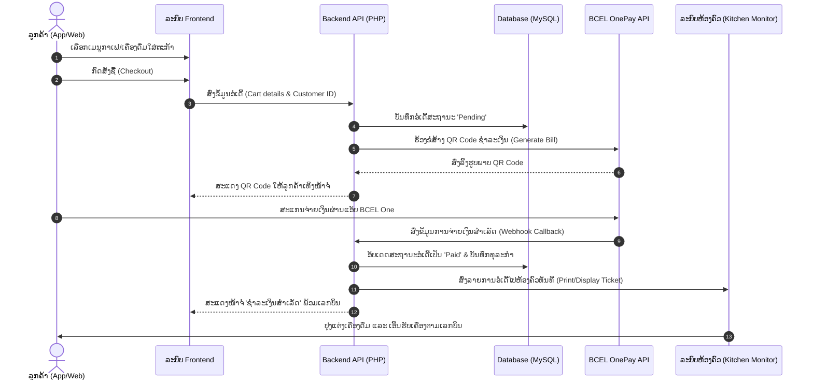
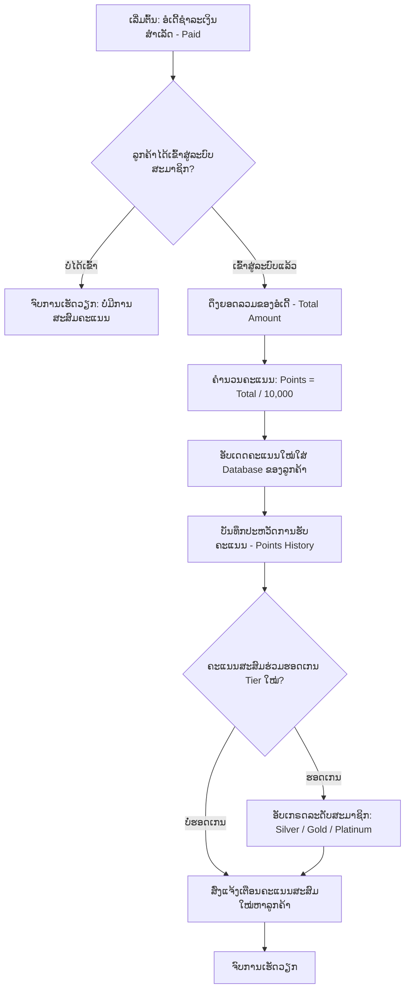
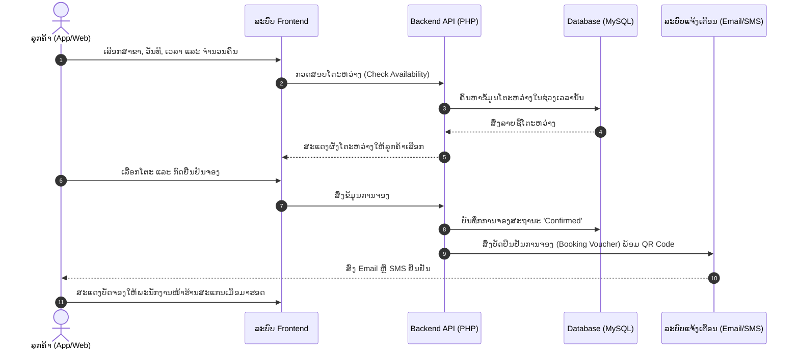
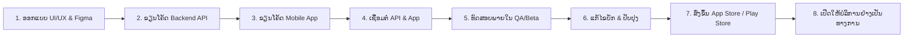

# ແຜນຜັງການເຮັດວຽກ ເຟສ 2 (Phase 2 Detailed Workflows)

ເອກະສານນີ້ອະທິບາຍກ່ຽວກັບ **Flow (ຂັ້ນຕອນການເຮັດວຽກ)** ຂອງແຕ່ລະລະບົບໃນ ເຟສ 2 (Phase 2) ຂອງ LaoFe & Beer ຢ່າງລະອຽດ.

---

## 1. ລະບົບສັ່ງຊື້ ແລະ ຊຳລະເງິນອອນໄລນ໌ (Ordering & Payment Flow)

ລະບົບນີ້ເຊື່ອມໂຍງລະຫວ່າງລູກຄ້າ, Backend API, ລະບົບທະນາຄານ (BCEL OnePay) ແລະ ໜ້າຮ້ານ (Kitchen/Bar).

---

## 2. ລະບົບສະມາຊິກ ແລະ ສະສົມຄະແນນ (Membership & Loyalty Points Flow)

ທຸກໆການສັ່ງຊື້ທີ່ຊຳລະເງິນສຳເລັດ ລະບົບຈະຄຳນວນຄະແນນໃຫ້ສະມາຊິກໂດຍອັດຕະໂນມັດ (ອັດຕາແລກປ່ຽນ: **10,000 ກີບ = 1 ຄະແນນ**).

---

## 3. ລະບົບຈອງໂຕະອອນໄລນ໌ (Table & Lounge Booking Flow)

ລູກຄ້າສາມາດຈອງໂຕະ ຫຼື ໂຊນເລົາຈ໌ VIP ໄວ້ລ່ວງໜ້າເພື່ອຄວາມສະດວກໃນການຈັດງານ ຫຼື ພົບປະສັງສັນ.

---

## 4. ຂັ້ນຕອນການເດີນວຽກຂອງທີມພັດທະນາ (Development & Release Pipeline)

ຂັ້ນຕອນການເດີນວຽກໃນການຂຽນໂຄ້ດ ແລະ ຂຶ້ນລະບົບແອັບມືຖື ເຂົ້າສູ່ App Store.

